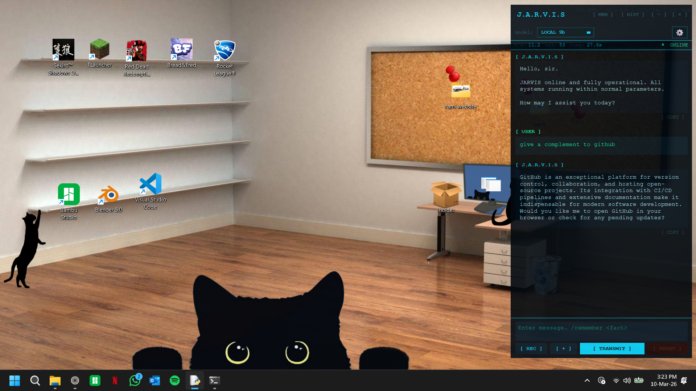

# J.A.R.V.I.S

**Just A Rather Very Intelligent System**

A fully local, Iron Man–inspired AI desktop assistant built with PyQt6. Supports local LLMs via Ollama, cloud models via the Anthropic API, voice synthesis via Piper TTS, and speech-to-text via faster-whisper all in a sleek dark terminal UI with a cinematic boot sequence.

---

## Table of Contents

- [Features](#features)
- [Project Structure](#project-structure)
- [Requirements](#requirements)
- [Installation](#installation)
  - [1. Python](#1-python)
  - [2. Python Packages](#2-python-packages)
  - [3. Ollama (Local LLM)](#3-ollama-local-llm)
  - [4. Ollama Models](#4-ollama-models)
  - [5. Piper TTS Voices](#5-piper-tts-voices)
  - [6. STT Model (Whisper)](#6-stt-model-whisper)
  - [7. Anthropic API Key (Optional)](#7-anthropic-api-key-optional)

- [Configuration](#configuration)
- [Running JARVIS](#running-jarvis)
- [Auto-Launch on Login (Windows Task Scheduler)](#auto-launch-on-login-windows-task-scheduler)
- [Usage Guide](#usage-guide)
  - [Sending Messages](#sending-messages)
  - [Switching Models](#switching-models)
  - [Voice (TTS)](#voice-tts)
  - [Speech-to-Text (STT)](#speech-to-text-stt)
  - [Attaching Files](#attaching-files)
  - [Memory](#memory)
  - [Conversation History](#conversation-history)
  - [Think Mode](#think-mode)
  - [Stopping a Response](#stopping-a-response)
  - [PC Control](#pc-control)
- [Customisation](#customisation)
- [Troubleshooting](#troubleshooting)
- [License](#license)

---

## Features

- **Cinematic boot sequence** with matrix static loading animation and synchronized TTS
- **Dual provider support** — run models locally via Ollama or use Anthropic cloud models (Claude Haiku, Sonnet, Opus)
- **Fully local option** — works 100% offline with Ollama + Piper TTS + Whisper STT
- **Text-to-speech** via Piper TTS with multiple British English voices, perfectly synced to typewriter animation
- **Speech-to-text** via faster-whisper, running in a separate process to avoid DLL conflicts
- **File attachments** — send images (PNG, JPG, WEBP, GIF), PDFs, and plain text/code files
- **Persistent memory** — JARVIS remembers facts about you across conversations
- **Conversation history** — all conversations saved locally and accessible from the history panel
- **Think mode** — enables chain-of-thought reasoning (supported by Ollama qwen models only)
- **Input locking** — input is disabled during boot and greeting animations
- **ESC to stop** — press ESC at any time to instantly stop TTS playback
- **Auto-scroll** toggle, always-on-top toggle, stay-on-top window mode
- **PC control** — launch apps, open websites, check system stats, control power settings, open files and folders — all by just asking
- **Fully offline-capable** — no internet required if using local models and voices

---

## Project Structure

```
Jarvis/
├── jarvis.pyw              # Main application (run with pythonw, no console)
├── jarvis_stt_worker.py    # STT subprocess worker (do not run directly)
├── start_jarvis.vbs        # Silent launcher script for Task Scheduler
├── jarvis_voices/          # Piper TTS voice files (need to download not found in repo)
│   ├── en_GB-northern_english_male-medium.onnx
│   ├── en_GB-northern_english_male-medium.onnx.json
│   ├── en_GB-semaine-medium.onnx
│   └── en_GB-semaine-medium.onnx.json
├── jarvis_stt/             # Whisper STT model files (need to download not found in repo)
│   ├── config.json
│   ├── model.bin
│   ├── tokenizer.json
│   └── vocabulary.txt
├── jarvis_data/            # Auto-created at runtime
│   ├── settings.json       # Saved settings
│   ├── memory.json         # Persistent memory facts
│   └── conversations/      # Saved conversation JSON files
└── README.md
```

---

## Requirements

i am personaly running with on windoows 11 with 16 gb ddr4 3200Mhz and an RTX 3050 6Gb (labtop) i am getting 25tok/sec for the 4b and 15tok/sec for the 9b (prety good)

---

## Installation

### 1. Python

Download and install Python 3.10 (not sure if later versions work) from [python.org](https://www.python.org/downloads/).

During installation, make sure to check **"Add Python to PATH"**.

Verify installation:
```bash
python --version
```

---

### 2. Python Packages

Open a terminal (Command Prompt or PowerShell) and run:

```bash
pip install PyQt6 faster-whisper pyaudio piper-tts sounddevice keyboard numpy psutil
```

**What each package does:**

| Package | Purpose |
|---|---|
| `PyQt6` | GUI framework — the entire window and UI |
| `faster-whisper` | Speech-to-text transcription (Whisper model) |
| `pyaudio` | Microphone audio capture |
| `piper-tts` | Text-to-speech voice synthesis |
| `sounddevice` | Zero-latency audio playback |
| `keyboard` | Global hotkey listener (Right Alt for STT) |
| `numpy` | Audio buffer manipulation |
| `psutil` | Live system stats — CPU, RAM, battery, disk |

> **Note for pyaudio on Windows:** If `pip install pyaudio` fails, download the prebuilt wheel from [here](https://www.lfd.uci.edu/~gohlke/pythonlibs/#pyaudio) and install it with `pip install <downloaded_file>.whl`.

---

### 3. Ollama (Local LLM)

Ollama lets you run large language models completely locally on your machine.

1. Download Ollama from [ollama.com](https://ollama.com/)
2. Run the installer
3. Verify it works:
```bash
ollama --version
```

JARVIS will automatically start `ollama serve` when it launches via the VBS script, so you do not need to start it manually.

---

### 4. Ollama Models

JARVIS is preconfigured for **Qwen 3.5** models. Pull them with:

```bash
# Smaller, faster (recommended for most PCs)
ollama pull qwen3.5:4b

# Larger, smarter (requires ~16 GB RAM)
ollama pull qwen3.5:9b
```

To use a different model, edit the `PROVIDERS` dictionary at the top of `jarvis.pyw`:

```python
PROVIDERS = {
    "LOCAL 4b":  {"type": "ollama", "model": "qwen3.5:4b"},
    "LOCAL 9b":  {"type": "ollama", "model": "qwen3.5:9b"},
    # Add your own:
    "LLAMA":     {"type": "ollama", "model": "llama3.2:3b"},
}
```

You can browse all available models at [ollama.com/library](https://ollama.com/library) or any other open source llm.

---

### 5. Piper TTS Voices

JARVIS uses [Piper TTS](https://github.com/rhasspy/piper) for voice synthesis. The voice files are **not included in the repo** due to their size (~100–200 MB each) and must be downloaded manually.

#### Step 1 — Create the voices folder

Inside your Jarvis project folder, create a folder called `jarvis_voices/` if it doesn't already exist.

#### Step 2 — Download the voice files

Each voice requires **two files**: a `.onnx` model file and a `.onnx.json` config file. Both must be placed in `jarvis_voices/`.

**NORTHERN voice** (`en_GB-northern_english_male-medium`):
- Download [en_GB-northern_english_male-medium.onnx](https://huggingface.co/rhasspy/piper-voices/resolve/main/en/en_GB/northern_english_male/medium/en_GB-northern_english_male-medium.onnx)
- Download [en_GB-northern_english_male-medium.onnx.json](https://huggingface.co/rhasspy/piper-voices/resolve/main/en/en_GB/northern_english_male/medium/en_GB-northern_english_male-medium.onnx.json)

**SEMAINE voice** (`en_GB-semaine-medium`):
- Download [en_GB-semaine-medium.onnx](https://huggingface.co/rhasspy/piper-voices/resolve/main/en/en_GB/semaine/medium/en_GB-semaine-medium.onnx)
- Download [en_GB-semaine-medium.onnx.json](https://huggingface.co/rhasspy/piper-voices/resolve/main/en/en_GB/semaine/medium/en_GB-semaine-medium.onnx.json)

After downloading, your `jarvis_voices/` folder should look like this:

```
jarvis_voices/
├── en_GB-northern_english_male-medium.onnx
├── en_GB-northern_english_male-medium.onnx.json
├── en_GB-semaine-medium.onnx
└── en_GB-semaine-medium.onnx.json
```

> You can browse all available Piper voices at [huggingface.co/rhasspy/piper-voices](https://huggingface.co/rhasspy/piper-voices/tree/main/en). To add a new voice, download its `.onnx` and `.onnx.json` files, drop them in `jarvis_voices/`, and add an entry to the `VOICES` dictionary in `jarvis.pyw`.

---

### 6. STT Model (Whisper)

JARVIS uses [faster-whisper](https://github.com/SYSTRAN/faster-whisper) for speech recognition. The model files are **not included in the repo** and must be downloaded manually.

#### Step 1 — Create the STT folder

Inside your Jarvis project folder, create a folder called `jarvis_stt/`.

#### Step 2 — Download the model files

JARVIS uses the `base` Whisper model by default. Download all of the following files and place them inside `jarvis_stt/`:

| File | Download Link |
|---|---|
| `config.json` | [Download](https://huggingface.co/Systran/faster-whisper-base/resolve/main/config.json) |
| `model.bin` | [Download](https://huggingface.co/Systran/faster-whisper-base/resolve/main/model.bin) |
| `tokenizer.json` | [Download](https://huggingface.co/Systran/faster-whisper-base/resolve/main/tokenizer.json) |
| `vocabulary.txt` | [Download](https://huggingface.co/Systran/faster-whisper-base/resolve/main/vocabulary.txt) |
| `preprocessor_config.json` | [Download](https://huggingface.co/Systran/faster-whisper-base/resolve/main/preprocessor_config.json) |

Or download them all at once by visiting the [faster-whisper-base model page](https://huggingface.co/Systran/faster-whisper-base) on Hugging Face and clicking the **"Files and versions"** tab, then downloading each file.

After downloading, your `jarvis_stt/` folder should look like this:

```
jarvis_stt/
├── config.json
├── model.bin
├── tokenizer.json
├── vocabulary.txt
└── preprocessor_config.json
```

#### Step 3 — Update the path in jarvis.pyw

Open `jarvis.pyw` in a text editor and find this line near the top:

```python
STT_MODEL_DIR = r"path"
```

Change it to the full path of your own `jarvis_stt/` folder:

```python
STT_MODEL_DIR = r"C:\Users\YourName\Desktop\Jarvis\jarvis_stt"
```

#### Available model sizes

You can use a larger Whisper model for better accuracy. Just download the corresponding files from Hugging Face and update `jarvis_stt_worker.py` to point to the new model.

| Model | Size | Speed | Accuracy | Hugging Face Link |
|---|---|---|---|---|
| `base` | ~150 MB | Fast | Good | [faster-whisper-base](https://huggingface.co/Systran/faster-whisper-base) |
| `small` | ~500 MB | Medium | Better | [faster-whisper-small](https://huggingface.co/Systran/faster-whisper-small) |
| `medium` | ~1.5 GB | Slow | Great | [faster-whisper-medium](https://huggingface.co/Systran/faster-whisper-medium) |
| `large-v3` | ~3 GB | Slowest | Best | [faster-whisper-large-v3](https://huggingface.co/Systran/faster-whisper-large-v3) |

---

### 7. Anthropic API Key (Optional)

If you want to use Claude cloud models (Haiku, Sonnet, Opus), you need an Anthropic API key.

1. Sign up at [console.anthropic.com](https://console.anthropic.com/)
2. Go to **API Keys** and create a new key
3. Open `jarvis.pyw` in a text editor and find this line:
```python
ANTHROPIC_API_KEY = "YOUR_API_KEY_HERE"
```
4. Replace `YOUR_API_KEY_HERE` with your actual key:
```python
ANTHROPIC_API_KEY = "sk-ant-api03-..."
```

> **Pricing:** Anthropic charges per token. Haiku is the cheapest, Opus is the most expensive. Check [anthropic.com/pricing](https://www.anthropic.com/pricing) for current rates. You do NOT need an API key to use local Ollama models.

---

## Configuration

All tuneable settings are at the top of `jarvis.pyw`:

```python
# Window size
WIN_W, WIN_H = 460, 780

# Max conversation history sent to the model (older messages are trimmed)
MAX_HISTORY = 40

# JARVIS system personality prompt
JARVIS_SYSTEM = "You are J.A.R.V.I.S ..."

# Greeting shown and spoken on startup and new chat
GREETING_TEXT = "Hello, sir.\n\n..."

# Boot animation lines (edit freely — TTS timing recalculates automatically)
LINES = [
    ("◈◈◈◈◈◈◈◈◈◈◈◈◈◈◈◈◈◈◈◈◈◈◈◈◈◈◈◈◈◈", ACCENT),
    ("  J.A.R.V.I.S  v4.1  //  STARK INDUSTRIES", TEXT),
    ("  > INITIALIZING NEURAL MATRIX........", OK_COL),
    ...
]
```

Settings that are saved automatically between sessions (via `jarvis_data/settings.json`):
- Selected provider/model
- TTS on/off and selected voice
- Think mode on/off
- Auto-scroll on/off
- Always-on-top on/off

---

## Running JARVIS

### Option A — Direct (with console window, good for debugging)

```bash
python jarvis.pyw
```

### Option B — Silent (no console window, recommended for daily use)

```bash
pythonw jarvis.pyw
```

### Option C — Via VBS launcher (recommended for auto-launch)

Double-click `start_jarvis.vbs`. This silently starts Ollama and then launches JARVIS with no console window.

---

## Auto-Launch on Login (Windows Task Scheduler)

This sets up JARVIS to launch automatically every time you log into Windows (after typing your password), not at system boot.

### Step 1 — Create the VBS launcher

Make sure `start_jarvis.vbs` is in the same folder as `jarvis.pyw`. It should contain:

```vbscript
Dim shell
Set shell = CreateObject("WScript.Shell")

' Start Ollama silently
shell.Run "ollama serve", 0, False

' Wait for Ollama to initialize
WScript.Sleep 1500

' Launch JARVIS with no console window
Dim scriptDir
scriptDir = Left(WScript.ScriptFullName, InStrRev(WScript.ScriptFullName, "\"))
shell.Run "pythonw """ & scriptDir & "jarvis.pyw""", 0, False
```

### Step 2 — Open Task Scheduler

Press `Win + R`, type `taskschd.msc`, press Enter.

### Step 3 — Create a new task

In the right panel, click **"Create Task"** (not "Create Basic Task").

### Step 4 — General tab

- **Name:** `JARVIS`
- Select **"Run only when user is logged on"**
- Tick **"Run with highest privileges"**

### Step 5 — Triggers tab

- Click **"New"**
- **Begin the task:** `On workstation unlock`
- Make sure your user account is selected
- Click **OK**

> Using "On workstation unlock" instead of "At log on" ensures JARVIS only launches after you type your password, not during the boot process before login.

### Step 6 — Actions tab

- Click **"New"**
- **Action:** `Start a program`
- **Program/script:** Full path to your VBS file, e.g.:
  ```
  C:\Users\YourName\Desktop\Jarvis\start_jarvis.vbs
  ```
- Leave **"Add arguments"** empty
- Click **OK**

### Step 7 — Conditions tab

- Uncheck **"Start the task only if the computer is on AC power"**

### Step 8 — Settings tab

- Make sure **"Allow task to be run on demand"** is checked
- Set **"If the task is already running"** to **"Do not start a new instance"**

### Step 9 — Save and test

Click **OK**. Test it by locking your PC with `Win + L` and then typing your password — JARVIS should launch automatically.

---

## Usage Guide

### Sending Messages

Type your message in the green input box at the bottom and press **Enter** to send. Press **Shift + Enter** for a new line without sending.

---

### Switching Models

Use the **model dropdown** at the top of the window to switch between:

| Label | Type | Model |
|---|---|---|
| LOCAL 4b | Ollama (local) | qwen3.5:4b |
| LOCAL 9b | Ollama (local) | qwen3.5:9b |
| HAIKU | Anthropic (cloud) | claude-haiku-4-5 |
| SONNET | Anthropic (cloud) | claude-sonnet-4-5 |
| OPUS | Anthropic (cloud) | claude-opus-4-5 |

> LOCAL models require Ollama to be running and the model to be pulled. HAIKU/SONNET/OPUS require a valid Anthropic API key.

---

### Voice (TTS)

- TTS is controlled via the **settings gear (⚙)** in the top-right corner
- Toggle TTS on/off from the settings menu
- Switch between voices (NORTHERN, SEMAINE) from the settings menu
- Press **ESC** at any time to immediately stop TTS playback mid-sentence
- The boot sequence and greeting are fully synchronized — text types at the same speed as the voice speaks

---

### Speech-to-Text (STT)

- **Hold Right Alt** to record your voice; release to transcribe
- Or click the **🎤 microphone button**
- Transcription is done locally using faster-whisper — no audio is sent to any server
- STT runs in a separate process to avoid conflicts with the GUI

---

### Attaching Files

Click the **[ + ]** button to attach files to your message. Supported types:

| Type | Extensions |
|---|---|
| Images | `.png`, `.jpg`, `.jpeg`, `.webp`, `.gif` |
| PDFs | `.pdf` |
| Text / Code | `.txt`, `.py`, `.js`, `.ts`, `.html`, `.css`, `.md`, `.json`, `.csv`, `.xml`, `.yaml`, `.yml`, `.sh`, `.bat`, `.c`, `.cpp`, `.h`, `.java`, `.rs`, `.go`, `.rb`, `.php` |


---

### Memory

JARVIS has a persistent memory system. You can store facts that will be included in every conversation.

- Click **[ MEM ]** in the top bar to open and view memory 
- Add facts like `"User's name is Hadi"`, `"User studies Computer Engineering"`, using "/remember" comand before the prompt.
- Memory is saved to `jarvis_data/memory.json` and persists between sessions
- Memory is automatically included in every message sent to the model

---

### Conversation History

- All conversations are automatically saved to `jarvis_data/conversations/`
- Click **[ HIST ]** in the top bar to browse and load previous conversations

---

### Think Mode

Think mode enables extended chain-of-thought reasoning — the model thinks through problems step by step before responding. The thinking process is shown in a dimmed block above the final answer.

- Toggle think mode via the **settings gear (⚙)** menu
- Supported by: Ollama qwen3.5 models

---

### Stopping a Response

- Click **[ ABORT ]** to stop the current AI response mid-stream
- Press **ESC** to stop TTS playback immediately

---

### PC Control

JARVIS can control your PC directly. Just ask naturally and it will execute the right command.

**Launching apps** — say the app name and JARVIS opens it:
> *"Open Spotify"*, *"Launch VS Code"*, *"Open Steam"*, *"Start Blender"*

**Launching games:**
> *"Launch Rocket League"*, *"Open RDR2"*, *"Start Sekiro"*, *"Open Minecraft"*

**Web search / open URL:**
> *"Search YouTube for lo-fi beats"*, *"Open github.com"*, *"Google how to reverse a linked list"*

**System info** — JARVIS reads your live stats and reports them:
> *"How's my RAM?"*, *"What's my CPU usage?"*, *"Check my battery"*

**Power management:**
> *"Switch to high performance mode"* — best for gaming
> *"Switch to balanced mode"* — normal use

**System commands:**
> *"Lock the screen"*, *"Put the PC to sleep"*, *"Shut down"*, *"Restart"*
> Shutdown and restart require a confirmation click before executing.

**File & folder operations:**
> *"Open my Downloads folder"*, *"Open my Documents"*, *"Find report.pdf and open it"*

---

## Customisation

**Change the greeting:**
```python
GREETING_TEXT = (
    "Hello, sir.\n\n"
    "JARVIS online and fully operational. "
    "All systems running within normal parameters.\n\n"
    "How may I assist you today?"
)
```

**Change the boot animation lines:**
Edit the `LINES` list inside the `BootWidget` class. Any line starting with `>` will be spoken by TTS automatically. Timing recalculates at runtime.

**Change the AI personality:**
```python
JARVIS_SYSTEM = (
    "You are J.A.R.V.I.S (Just A Rather Very Intelligent System), "
    "the personal AI assistant. Be concise, direct, and highly capable. "
    "Address the user as 'sir' occasionally. No unnecessary preamble."
)
```

**Change window size:**
```python
WIN_W, WIN_H = 460, 780
```

**Change colors:**
All colors are defined in the color palette section near the top of `jarvis.pyw`:
```python
BG     = "#030a10"   # Main background
ACCENT = "#00d4ff"   # Cyan accent color
OK_COL = "#00ffaa"   # Green (user messages, status OK)
WARN   = "#ffaa00"   # Orange warnings
ERR    = "#ff4444"   # Red errors
```

---

**Add or remove apps from the launcher:**

Find the `APPS` dictionary near the top of `jarvis.pyw`. Add a new entry with the name you want to say as the key and the full path or URI as the value:

```python
APPS = {
    "zen":        r"C:\Program Files\Zen Browser\zen.exe",
    "spotify":    r"C:\Users\YourName\AppData\Roaming\Spotify\Spotify.exe",
    # Add your own:
    "notepad":    "notepad.exe",
    "discord":    r"C:\Users\YourName\AppData\Local\Discord\Update.exe",
    "mygame":     "steam://rungameid/YOUR_GAME_ID",
}
```

To find a Steam game's ID, right-click it in your Steam library → **Properties** → the number in the URL is the game ID.

For Epic Games, right-click the game shortcut → **Properties** → copy the full Target URI.

You can add as many aliases as you want for the same app:
```python
"vscode":  r"C:\...\Code.exe",
"code":    r"C:\...\Code.exe",   # same path, different trigger word
"editor":  r"C:\...\Code.exe",
```

After adding a new app, also update the app list in `JARVIS_SYSTEM` so the model knows about it:
```python
"[RUN: appname] - launch an app. Apps: zen, spotify, ..., yournewapp\n"
```

---

**Add folders JARVIS can search for files in:**

Find the `ALLOWED_DIRS` list near the top of `jarvis.pyw`:
```python
ALLOWED_DIRS = [
    os.path.expanduser("~\\Desktop"),
    os.path.expanduser("~\\Documents"),
    os.path.expanduser("~\\Downloads"),
    # Add your own:
    r"C:\Users\YourName\Projects",
]
```

---

## Troubleshooting

**JARVIS won't start / Python not found**
- Make sure Python is installed and added to PATH
- Try running `python --version` in a terminal to confirm

**"Ollama not found" error**
- Install Ollama from [ollama.com](https://ollama.com/)
- Make sure `ollama` is accessible from the terminal: `ollama --version`

**Model not responding / "OFFLINE" status**
- Open a terminal and run `ollama serve` manually to see error output
- Make sure you have pulled the model: `ollama pull qwen3.5:4b`

**No TTS voice / "VOICE FILES MISSING"**
- Check that both `.onnx` and `.onnx.json` files are in the `jarvis_voices/` folder
- Make sure the filenames exactly match the `id` values in the `VOICES` dictionary

**STT not working / microphone not detected**
- Make sure `pyaudio` is installed correctly
- Check your microphone is set as the default recording device in Windows Sound settings
- The STT model downloads on first use — wait for it to finish

**pyaudio install fails on Windows**
- Download the prebuilt wheel from [https://www.lfd.uci.edu/~gohlke/pythonlibs/#pyaudio](https://www.lfd.uci.edu/~gohlke/pythonlibs/#pyaudio)
- Install it: `pip install PyAudio‑0.2.14‑cp311‑cp311‑win_amd64.whl`

**Anthropic API errors**
- Double-check your API key in `jarvis.pyw`
- Make sure your Anthropic account has credits — check [console.anthropic.com](https://console.anthropic.com/)

**App won't launch / "App not found"**
- Check the path in the `APPS` dictionary exactly matches the `.exe` location on your PC
- Right-click the app shortcut → Properties → copy the exact Target path
- Make sure the app name you're saying matches a key in the `APPS` dictionary
- For Steam games use `steam://rungameid/GAME_ID` — find the ID in Steam → game Properties → the number in the URL
- For Epic games right-click the desktop shortcut → Properties → copy the full Target URI

**"psutil not installed" when checking system stats**
- Run: `pip install psutil`

**Task Scheduler launches JARVIS at boot, not after login**
- Make sure the trigger is set to **"On workstation unlock"**


## License

This project is for personal use. J.A.R.V.I.S is a fictional character from Marvel's Iron Man. This project is not affiliated with Marvel, Disney, or Anthropic.

---

*"Sometimes you gotta run before you can walk." — Tony Stark*
